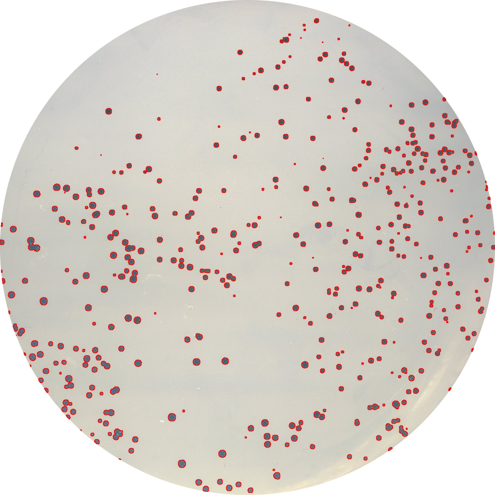

# ParticleArea
This macro allows batch processing of images to get the particles area and add an overlay on the images. 

## Original

## Watershed

## No Watershed

## Results Table
Results are tidy! 
